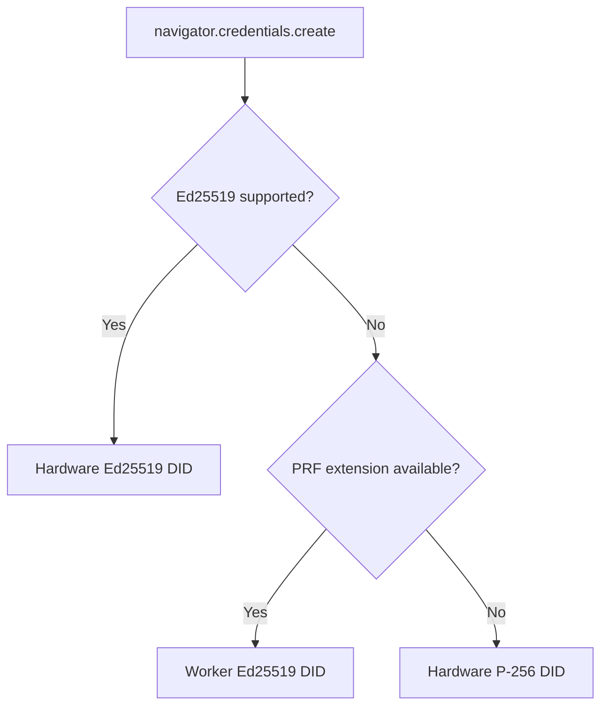

# Identity & WebAuthn

The identity system uses WebAuthn passkeys to derive decentralized identifiers (DIDs) without a central authority.

## Mode Detection

The `IdentityService` automatically detects the best signing mode:

1. **Hardware Ed25519** — Authenticator natively supports Ed25519 (e.g., YubiKey 5). Most secure.
2. **Hardware P-256** — Authenticator supports ECDSA P-256 with varsig encoding.
3. **Worker Ed25519** — PRF seed extracted from WebAuthn, used to derive Ed25519 keys in a Web Worker. Required for P2P/OrbitDB identity.



## Key Files

- `src/lib/identity/identity-service.js` — Main orchestrator
- `src/lib/identity/mode-detector.js` — Hardware vs worker detection

## IdentityService API

```js
import { IdentityService } from 'p2pass';

const identity = new IdentityService();

// Initialize (triggers biometric prompt)
const signingMode = await identity.initialize(undefined, { preferWorkerMode: true });
// → { mode: 'worker', did: 'did:key:z6Mk...', algorithm: 'Ed25519', secure: true }

// Get UCAN-compatible signer
const principal = await identity.getPrincipal();

// Bind OrbitDB registry for credential storage
await identity.setRegistry(db);

// Get IPNS keypair for recovery manifest
const ipnsKP = identity.getIPNSKeyPair();
```

## Credential Storage

- **First visit**: `navigator.credentials.create()` → PRF seed → Ed25519 DID generated
- **Return visit**: Cached archive in `localStorage` → `navigator.credentials.get()` → same DID restored
- **With OrbitDB**: Credentials flushed from memory to registry DB via `setRegistry(db)`

The encrypted archive is cached in `localStorage` (`p2p_passkeys_worker_archive`) for bootstrap restore before the registry DB is available.

## Recovery Flow

1. User clicks "Recover Identity"
2. Discoverable credential triggers biometric → PRF seed extracted
3. IPNS keypair derived from seed
4. **Local-first**: Check OrbitDB for stored archive (fast)
5. **IPNS fallback**: Resolve manifest from w3name, fetch archive from IPFS gateway
6. DID restored from encrypted archive
