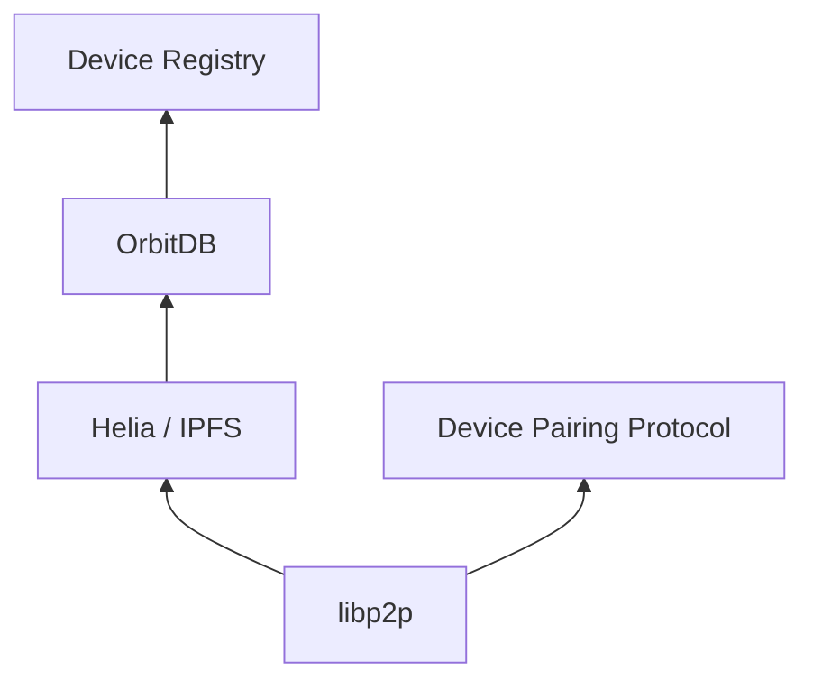

# P2P Stack

The P2P layer uses libp2p for networking, Helia for IPFS content routing, and OrbitDB for replicated databases.

## Stack Overview



## Initialization

```js
import { setupP2PStack, createLibp2pInstance, cleanupP2PStack } from 'p2pass';

// Option 1: libp2p only (before authentication)
const libp2p = await createLibp2pInstance();

// Option 2: Full stack with OrbitDB
const stack = await setupP2PStack(credential, { libp2p });
// stack.libp2p, stack.orbitdb, stack.helia
```

`setupP2PStack` falls back to a default OrbitDB identity when the credential lacks full WebAuthn properties.

## libp2p Configuration

The library configures libp2p with:

- **Transports**: WebSockets, WebRTC
- **Encryption**: Noise
- **Multiplexing**: Yamux
- **Discovery**: Bootstrap peers, PubSub peer discovery
- **NAT traversal**: AutoNAT, DCUtR, Circuit Relay v2

## Device Registry

An OrbitDB keyvalue database stores device information with key prefixes:

| Prefix        | Content                                                   |
| ------------- | --------------------------------------------------------- |
| _(none)_      | Device entries (credential_id, device_label, ed25519_did) |
| `delegation:` | UCAN proof strings                                        |
| `archive:`    | Encrypted Ed25519 key archives                            |
| `keypair:`    | DID public key metadata                                   |

The registry access controller includes both `orbitdb.identity.id` and the owner DID.

## Key File

- `src/lib/p2p/setup.js` — `createLibp2pInstance`, `createHeliaInstance`, `setupP2PStack`, `cleanupP2PStack`

## Environment

Bootstrap peers are configured via `VITE_BOOTSTRAP_PEERS` environment variable (comma-separated multiaddrs).

## Important Notes

- The example app imports from built `dist/` via the `p2pass` alias (not `../src/lib`) to avoid Vite worker hot-reload issues
- After source changes: `npm run package` before the example picks them up
- `optimizeDeps.exclude: ['@le-space/orbitdb-identity-provider-webauthn-did']` is required in Vite config
