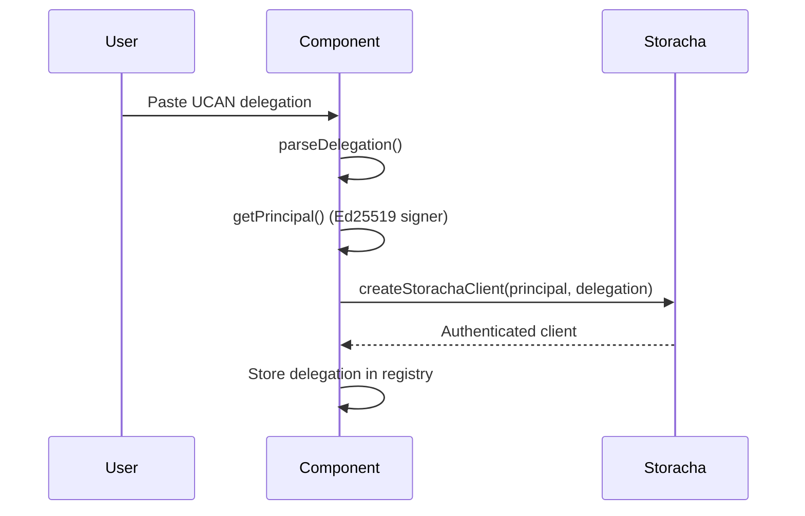

# Storacha Backup

Backup and restore uses UCAN-delegated access to Storacha decentralized storage with IPNS recovery manifests.

## Auth Flow

The library uses UCAN-only authentication for Storacha — no key+proof credential login.



## Key Functions

```js
import {
  createStorachaClient,
  parseDelegation,
  storeDelegation,
  loadStoredDelegation,
  clearStoredDelegation
} from 'p2p-passkeys';
```

- `parseDelegation(proofString)` — Parse multibase, base64, or CAR bytes
- `createStorachaClient(principal, delegation)` — Create authenticated client
- `storeDelegation(base64, registryDb?, spaceDid?)` — Store in registry or localStorage
- `loadStoredDelegation(registryDb?)` — Load stored delegation
- `clearStoredDelegation(registryDb?)` — Clear delegation(s)

## Backup & Restore

The `OrbitDBStorachaBridge` handles block-level backup and restore:

```js
import { OrbitDBStorachaBridge } from 'orbitdb-storacha-bridge';

const bridge = new OrbitDBStorachaBridge({ ucanClient: client });
bridge.spaceDID = currentSpace.did();

// Backup
const result = await bridge.backup(orbitdb, database.address);

// Restore
const result = await bridge.restoreFromSpace(orbitdb, {
  timeout: 120000,
  preferredDatabaseName: 'my-db',
  restartAfterRestore: true,
  verifyIntegrity: true
});
```

## IPNS Recovery Manifest

After backup, an IPNS manifest is published containing:
- `registryAddress` — OrbitDB registry address
- `delegation` — UCAN delegation string
- `ownerDid` — The user's Ed25519 DID
- `archiveCID` — IPFS CID of the encrypted key archive

```js
import {
  createManifest,
  publishManifest,
  resolveManifest,
  uploadArchiveToIPFS,
  fetchArchiveFromIPFS
} from 'p2p-passkeys';
```

## Storage Hierarchy

1. **Registry DB** (preferred) — OrbitDB keyvalue database, replicated across devices
2. **localStorage** (fallback) — Used before registry is available
   - `p2p_passkeys_registry_address` — Registry OrbitDB address
   - `p2p_passkeys_owner_did` — Owner DID for local-first recovery
   - `p2p_passkeys_worker_archive` — Encrypted Ed25519 archive for bootstrap

## Key Files

- `src/lib/ucan/storacha-auth.js` — UCAN client creation and delegation storage
- `src/lib/backup/registry-backup.js` — Registry DB backup/restore
- `src/lib/recovery/manifest.js` — IPNS manifest publish/resolve
- `src/lib/recovery/ipns-key.js` — Deterministic IPNS keypair derivation
