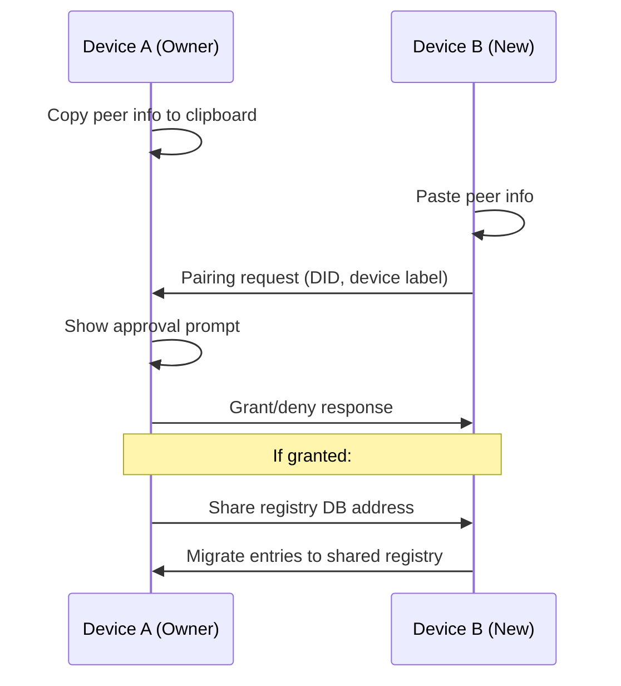

# Multi-Device Linking

Link multiple devices to share the same identity and OrbitDB registry over libp2p.

## Overview

Device linking uses the `/orbitdb/link-device/1.0.0` libp2p protocol:



## Usage

### Device A (Owner)

1. Authenticate with passkey
2. Switch to "P2P Passkeys" tab
3. Click copy button to get peer info JSON
4. Share peer info with Device B (paste, QR code, etc.)

### Device B (New Device)

1. Authenticate with passkey
2. Switch to "P2P Passkeys" tab
3. Paste Device A's peer info JSON
4. Click "Link Device"
5. Wait for Device A to approve

### Programmatic Usage

```js
import { MultiDeviceManager } from 'p2p-passkeys';

const manager = await MultiDeviceManager.createFromExisting({
  credential,
  orbitdb,
  libp2p,
  identity: { id: signingMode.did },
  onPairingRequest: async (request) => {
    // Show approval UI, return 'granted' or 'rejected'
    return 'granted';
  },
  onDeviceLinked: (device) => {
    console.log('New device linked:', device.device_label);
  },
});

// Open existing registry
await manager.openExistingDb(registryAddress);

// Link to another device
const result = await manager.linkToDevice(peerInfoJson);
```

## Registry Migration

When Device B links to Device A, entries from Device B's local registry are migrated to the shared registry:

- Keypair entries
- Encrypted archives
- UCAN delegations

The migration retries writes until the ACL grant propagates (up to 2 minutes).

## Key Files

- `src/lib/registry/manager.js` — `MultiDeviceManager` class
- `src/lib/registry/pairing-protocol.js` — libp2p protocol handler
- `src/lib/registry/device-registry.js` — Registry CRUD operations
