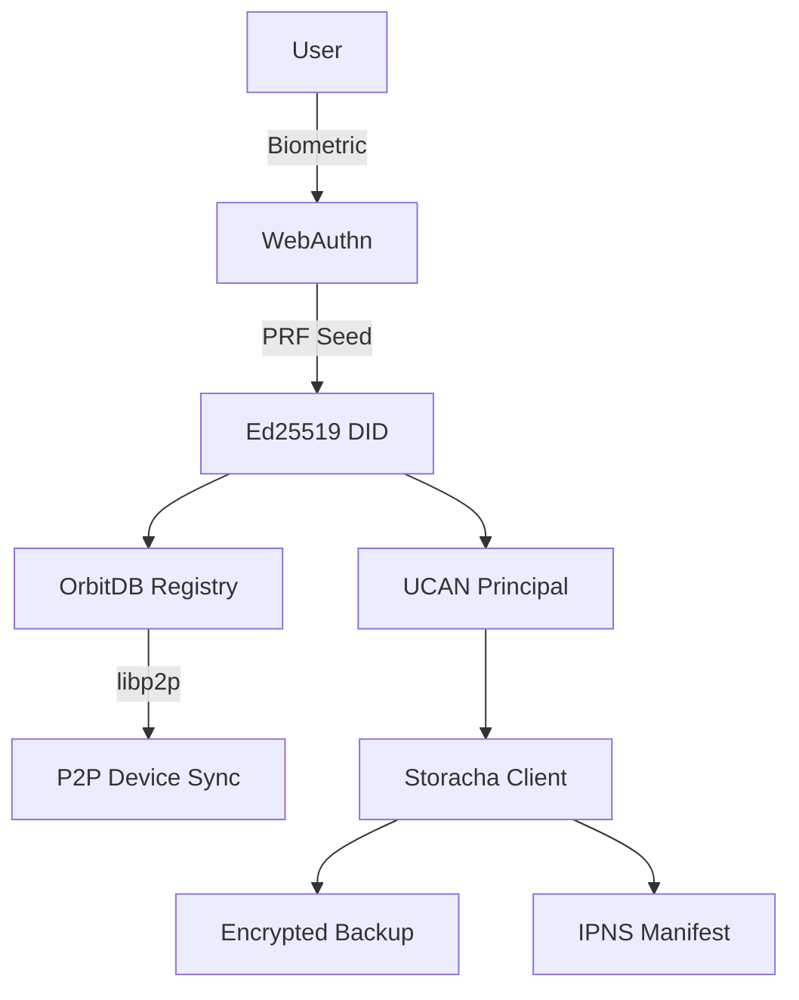

# Introduction

**P2Pass** is a standalone Svelte component (with React wrapper) for P2P passkey-based DID identities with Storacha decentralized backup.

Drop in `<P2Pass />` and get:

- Passkey authentication via WebAuthn
- UCAN delegation and Storacha backup/restore
- OrbitDB device registry for multi-device sync
- libp2p peer-to-peer device linking

## Key Features

### Passkey Authentication

WebAuthn biometric prompts derive deterministic Ed25519 DIDs using PRF seed extraction. Supports hardware Ed25519, hardware P-256, and worker-derived Ed25519 modes with automatic detection.

### P2P Device Linking

Devices discover each other over libp2p and pair using an approval-based protocol (`/orbitdb/link-device/1.0.0`). An OrbitDB keyvalue registry stores credentials, UCAN delegations, and encrypted archives.

### Storacha Backup

UCAN-only authentication for Storacha storage. Backup your OrbitDB databases and device registry. IPNS recovery manifest enables cross-device identity restoration without a central server.

### Framework Support

- **Svelte**: Native `P2Pass` and `P2PassPanel` components
- **React**: Thin wrapper components that mount the Svelte widget via `p2pass/react`

## Architecture Overview

## Source

- GitHub: [P2Pass repository](https://github.com/asabya/p2pass)
- Issue tracker: [NiKrause/simple-todo#24](https://github.com/NiKrause/simple-todo/issues/24)
